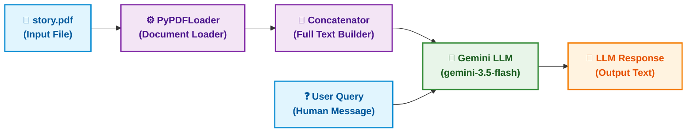

# LLM-powered PDF QA

A simple demo that loads a PDF, concatenates its text, and queries a Google generative LLM (Gemini) for answers.

Features
- Load PDF pages with `PyPDFLoader`.
- Concatenate full document text and pass it to `ChatGoogleGenerativeAI`.
- Example query flow implemented in `main.py`.

Files
- [main.py](main.py#L1-L26) — example script that loads `story.pdf` and queries the model.
- [io_diagram.md](io_diagram.md) — diagram showing the input/output flow.

## Input / Output Flow

Here is the horizontal block diagram showing the flow of data in this project:


### System Architecture Flowchart



Setup
1. Create and activate a Python virtual environment.

```powershell
python -m venv venv
venv\Scripts\Activate.ps1
```

2. Install dependencies:

```bash
pip install -r requirements.txt
```

3. Add credentials and the PDF:
- Place your PDF as `story.pdf` in the project root.
- Create a `.env` file with your Google credentials (example key name shown below). The exact variable depends on the Google client you use; try `GOOGLE_API_KEY` or follow the provider docs.

Example `.env`:

```
GOOGLE_API_KEY=your_api_key_here
```

Usage
1. Ensure `story.pdf` is present.
2. Run the script:

```bash
python main.py
```

If everything is configured the script will print the model's response to the console.

Pushing to your GitHub repo
1. Initialize git (if not already):

```bash
git init
git add .
git commit -m "Add project files and README"
```

2. Add your remote and push (replace with your repo URL):

```bash
git remote add origin https://github.com/hsachan295-source/llm-powered-pdf-qa.git
git branch -M main
git push -u origin main
```

Notes
- The `requirements.txt` includes the main libraries used in `main.py`. If your environment uses different package names, update accordingly.
