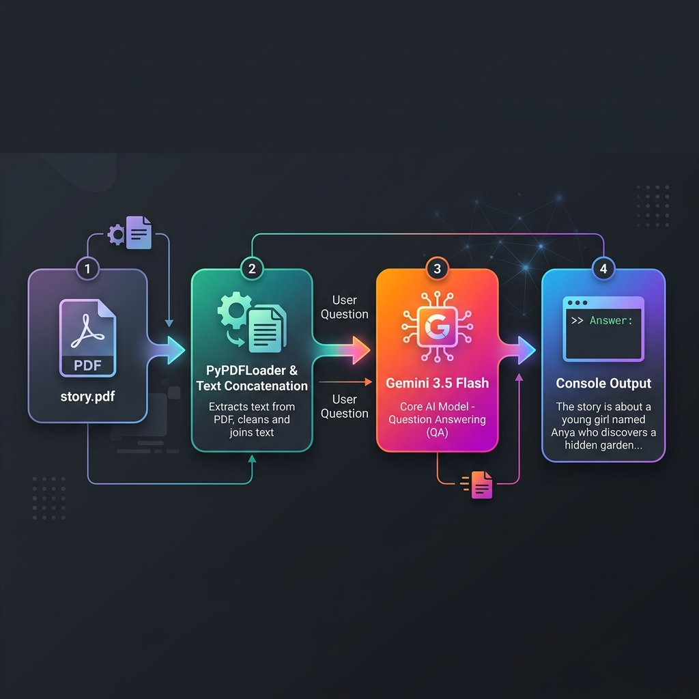
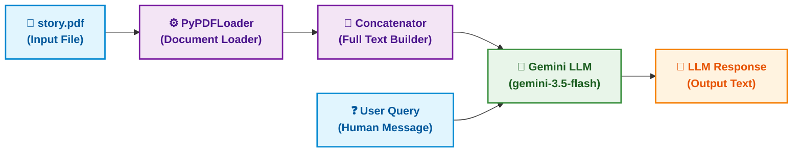

# Input / Output Flow (Horizontal)

Here is the horizontal block diagram showing the flow of data:

### System Architecture Flowchart

This diagram shows the left-to-right flow: PDF file -> loader -> text aggregation -> LLM + query -> response -> output.

